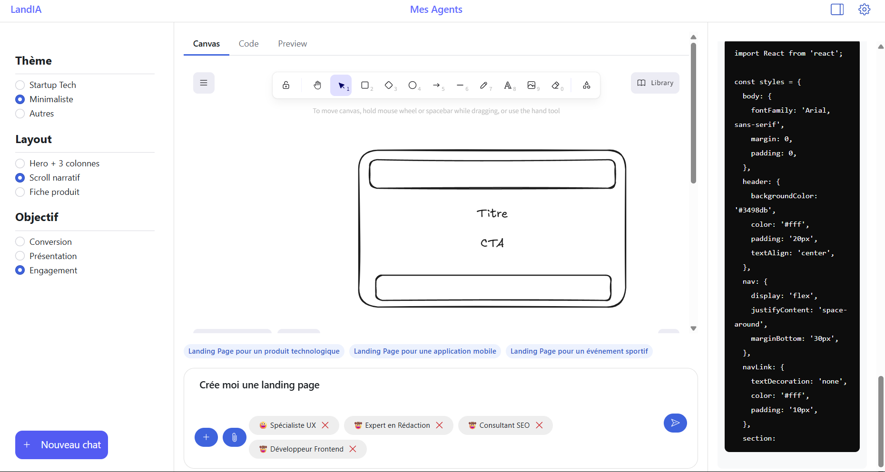
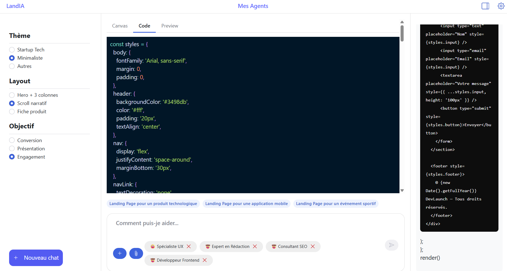
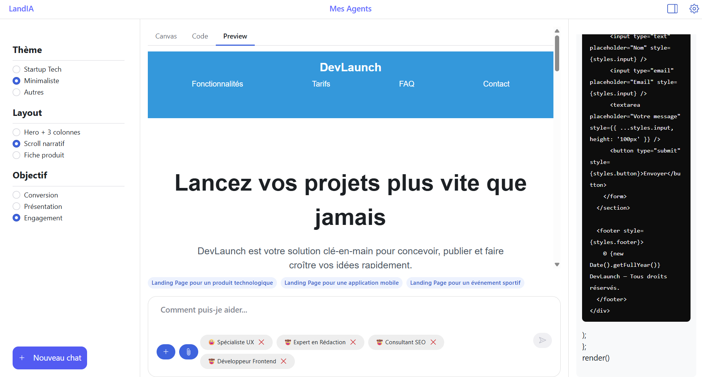

# Théo Le Gourrierec - 3B2

---

## Captures d'écrans

## Introduction

---

Dans le cadre d'un projet en Développement Web MMI, notre but est de trouver un problème qui peut être résolu via plusieurs agents IA.

## Problème / Besoin

---

Il est parfois compliqué de partir de zéro pour créer une landing page, à cause du manque d'inspiration, de ne pas savoir écrire, par où commencer ? Ici, mon application répond à ce problème et permet de créer une landing page à partir d'un prompt.

## Solution : UI / Interaction / architecture

---

**Mon interface utilisateur est divisé en 3 colonnes :**
**Colonne de gauche :** ici on retrouve les différents choix via des entrées de type "radio" qui nous permettent d'orienter le thème de la landing page. Ces choix sont insérés dans une phrase au moment de l'envoi du prompt.
**Colonne du milieu :** On retrouve ici les éléments principaux de l'application, que ce soit la l'entrée du prompt avec le choix des différents agents IA qu'on peut venir changer l'ordre, les supprimer ou en ajouter parmi une liste. En haut, il y a 3 onglets "Draw", "Code", "Preview", Draw nous ouvre une interface Excalidraw qui nous permet de prototyper notre futur landing page, pour que cela fonctionne, il faut dessiner son prototype et avoir un modèle d'IA compatible qui prend en charge la lecture d'images (Exemple : google/gemma-3-4b qui est un modèle à 4B de paramètres et pèse 3.34GO seulement). Ensuite, nous avons l'onglet "Code", ou ici quand notre agent "Développeur web" aura fini son code, celui-ci s'affichera et nous pourrons prévisualiser le résultat dans l'onglet "Preview".
**Colonne de droite :** Ici nous pouvons voir le chat avec les différents agents IA.

Au niveau des interactions, nous pouvons masquer / afficher le chat, quand l'utilisateur vient cliquer sur le champ de texte pour écrire son prompt, celui-ci s'ouvre en grand pour faciliter la lecture et l'écriture. Il y a également un onglet paramètres qui nous permet de modifier l'URL de connexion ainsi que le modèle de LLM pour se connecter en local sans changer le .env.

## Réflexion

---

L'application est entièrement fonctionnelle, mais les résultats sont encore très simplistes, cela est dû au modèle utiliser, pour gagner en rapidité de développement, nous utilisons des petits modèles avec peu de paramètres, des plus gros modèles seront beaucoup plus performant pour cette application.

### Problèmes

J'ai été amenée à rencontré problème précis lors de ce projet :
**Code généré :** Pour avoir une prévisualisation du code, j'ai utilisé React Live, un package npm qui permet d'afficher le rendu d'un code react sur une page web. Nous avons du utiliser des regex pour supprimer certaines lignes du code généré, car React Live ne voulait pas exécuter ce code. De plus le css avait du mal à être généré, pour régler cela, je lui ai dit d'utiliser cssInJS.

### Améliorations

Pour aller plus loin dans ce projet, je pourrais ajouter la création de compte utilisateur ou chaque personne pourrait retrouver ses conversations.
De plus, pour aller encore plus loin, on pourrait ajouter un bouton "Push website" qui nous permettrait de mettre en ligne en le site généré via Surge par exemple.

## Conclusion

---

À travers ce projet, j'ai pu découvrir comment développer une application en React qui est connecté avec un LLM en local.
Cela était très intéressant sur le point de vue technique ou de culture informatique.
